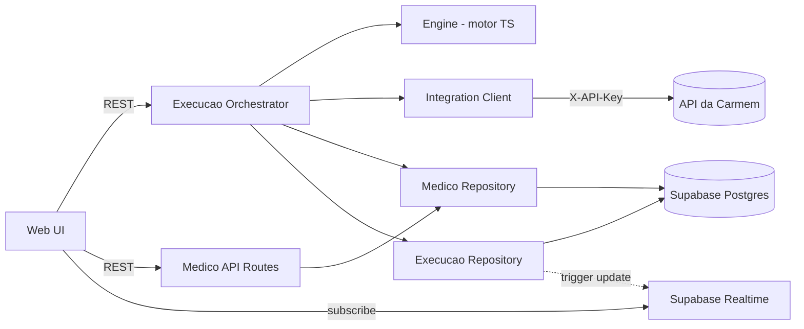
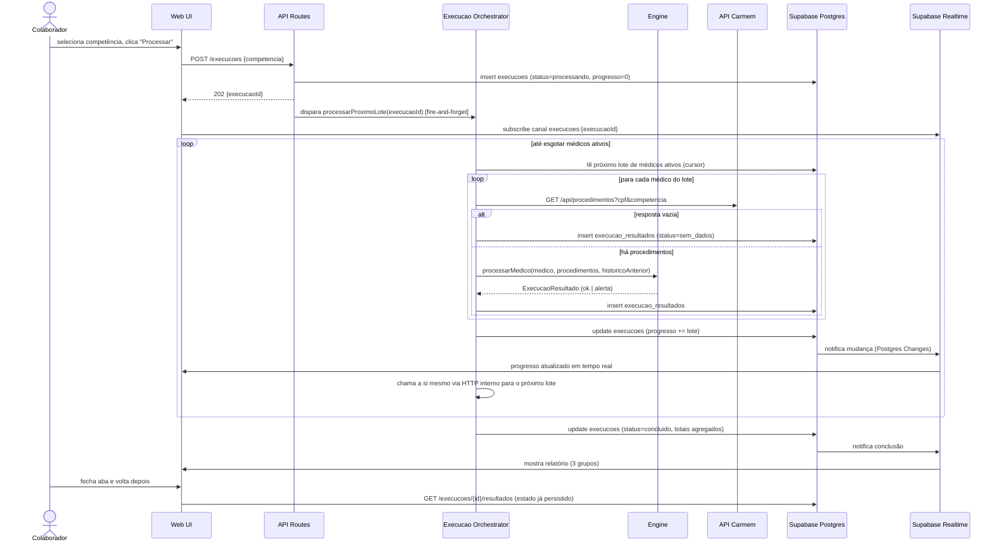
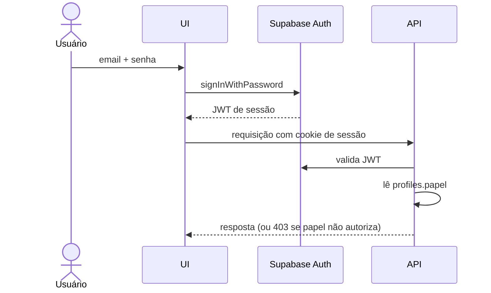
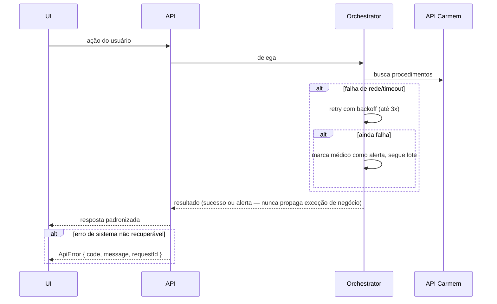

# Sistema de Cobrança por Guias — Carmem Cavalcante Contabilidade Fullstack Architecture Document

> Gerado em modo YOLO (direto) a partir de `PRD_sistema_cobranca.md` e do motor de referência `motor_guias_v2.py`. Toda decisão de stack já estava travada no PRD (seção 6) — este documento detalha como ela se materializa em código, dados e fluxos.

## Introduction

Este documento descreve a arquitetura fullstack completa do sistema que substitui a contagem manual de guias, a digitação em planilha e o cálculo manual de boleto por um pipeline determinístico: busca de procedimentos → contagem → trava de conferência → preço por classe → relatório com revisão humana antes de qualquer emissão.

### Starter Template or Existing Project

N/A — Greenfield. Não há starter template ou repositório existente. O único artefato de partida é o motor de regras em Python (`motor_guias_v2.py`), que **não é código de produção**: é a especificação executável das regras de contagem e preço, e deve ser portado para TypeScript preservando exatamente a lógica (PRD §6.1, §12 — os exemplos da Dra. A e do Dr. E são o teste de regressão do motor portado).

### Change Log

| Date | Version | Description | Author |
|---|---|---|---|
| 2026-06-24 | 1.0 | Primeira versão, derivada do PRD v1.0 | Aria (Architect) |

---

## High Level Architecture

### Technical Summary

O sistema é uma aplicação Next.js (App Router) hospedada na Vercel, full-stack num único deploy: as rotas de API do próprio Next.js implementam o motor de contagem/preço (porte direto do `motor_guias_v2.py`) e orquestram o processamento assíncrono por competência. O Supabase fornece Postgres (cadastro de médicos, histórico, execuções e resultados) e Auth (login por papel); ele **não armazena procedimentos** — esses vêm sempre ao vivo da API do sistema próprio da Carmem (autenticada por API Key), conforme o contrato do PRD §6.4. Como funções serverless da Vercel têm tempo de execução limitado e uma competência processa 150–300 médicos, o disparo do colaborador cria um registro `execucoes` e dispara processamento em lotes encadeados (chamadas subsequentes da própria função, não uma fila gerenciada — ver Core Workflows), com progresso gravado no Postgres e acompanhado via Supabase Realtime. Essa arquitetura atende ao PRD: stack único, sem exportação manual, erro silencioso convertido em alerta revisável antes da emissão.

### Platform and Infrastructure Choice

O PRD (§6.1) já trava a escolha: **Vercel + Supabase**. Documentando a justificativa para registro:

| Opção | Prós | Contras |
|---|---|---|
| **Vercel + Supabase** (escolhido) | Deploy único, Auth + Postgres prontos, Realtime nativo para progresso, custo baixo para 150–300 médicos/mês | Limite de duração de função serverless exige desenho assíncrono explícito |
| AWS Full Stack (Lambda + RDS + Cognito) | Sem limite de tempo com Step Functions | Overhead de infra desproporcional ao volume mensal do projeto; mais peças para uma equipe pequena operar |
| Azure / GCP | Não há ecossistema .NET ou ML aqui | Sem vantagem para este caso |

**Platform:** Vercel (frontend + API routes) + Supabase (Postgres + Auth + Realtime)
**Key Services:** Vercel Functions (Node.js runtime), Supabase Postgres, Supabase Auth, Supabase Realtime
**Deployment Host and Regions:** Vercel (região padrão `gru1`/São Paulo se disponível no plano; senão `us-east` mais próximo), Supabase projeto na região `sa-east-1` (São Paulo) — minimiza latência e atende dado sensível (LGPD, PRD §9) mantendo-o em território nacional quando possível.

### Repository Structure

**Structure:** Monorepo simples (não é um produto multi-app — é uma única aplicação Next.js). Não se justifica Nx/Turborepo para este escopo; adiciona complexidade sem benefício, dado que há um único app e um pacote compartilhado de tipos.
**Monorepo Tool:** Nenhum — workspaces nativos do npm são suficientes (`apps/web` + `packages/shared`).
**Package Organization:**
- `apps/web` — aplicação Next.js (UI + API routes + motor de cálculo)
- `packages/shared` — tipos TypeScript compartilhados (modelos de domínio, contrato da API externa, contrato do Supabase)

### High Level Architecture Diagram

```mermaid
graph TB
    User[Colaborador / Admin / Financeiro] -->|HTTPS, login| Web[Next.js App - Vercel]
    Web -->|Server Components / API Routes| API[API Routes - Vercel Functions]
    API -->|CRUD cadastro, histórico, execuções| Supabase[(Supabase Postgres)]
    API -->|Auth, RLS por papel| SupaAuth[Supabase Auth]
    Web -->|subscribe progresso| Realtime[Supabase Realtime]
    API -->|GET /api/procedimentos com X-API-Key| External[Sistema próprio da Carmem]
    API -->|motor de contagem/preço| Engine[Engine TS - porte do motor_guias_v2.py]
    Engine --> API

    subgraph Vercel
        Web
        API
        Engine
    end

    subgraph Supabase
        Supabase
        SupaAuth
        Realtime
    end
```

### Architectural Patterns

- **Jamstack-style monolito serverless:** Next.js fullstack único, sem backend separado — _Rationale:_ PRD exige stack único, um repositório, um deploy; o volume (150–300 médicos/mês) não justifica microsserviços.
- **BFF implícito (API Routes como camada de integração):** as API routes do Next.js são o único ponto que fala com a API externa da Carmem e com o Supabase — _Rationale:_ a API Key da Carmem nunca deve chegar ao browser; toda integração externa fica no servidor.
- **Engine puro e isolado (núcleo funcional sem efeito colateral):** `packages/shared` ou `apps/web/src/server/engine` contém funções puras de contagem e preço, sem I/O — _Rationale:_ é a parte mais sensível do sistema (regra validada com dado real); isolar permite testar com os casos do PRD §12 sem mockar rede ou banco.
- **Lote encadeado para processamento longo (chained batch / self-invoking job):** a execução de uma competência avança em lotes pequenos de médicos, cada lote disparando o próximo via chamada HTTP interna — _Rationale:_ contorna o limite de duração de função serverless da Vercel sem introduzir uma fila gerenciada externa (PRD §6.3 deixa a escolha de mecanismo aberta; lotes encadeados é a opção mais simples e sem nova peça de infraestrutura).
- **Repository pattern para acesso ao Supabase:** toda leitura/escrita em `medicos`, `medicos_historico`, `execucoes`, `execucao_resultados` passa por funções de repositório dedicadas — _Rationale:_ centraliza a regra "toda escrita em médico gera histórico" (PRD §7, item não-opcional) num único lugar, em vez de espalhar `update` direto pela UI.

---

## Tech Stack

> PRD §6.1 já define a escolha de framework/hosting/banco. Esta tabela fixa as versões e completa as peças não especificadas no PRD (testes, build, monitoramento) com escolhas pragmáticas — "boring technology" alinhada ao próprio ecossistema Next.js/Vercel/Supabase.

| Category | Technology | Version | Purpose | Rationale |
|---|---|---|---|---|
| Frontend Language | TypeScript | 5.x | Tipagem em toda a base, incluindo o motor portado | Mesma linguagem do backend — PRD exige stack único |
| Frontend Framework | Next.js (App Router) | 14.x | UI + API routes + SSR | Definido no PRD §6.1 |
| UI Component Library | shadcn/ui (Radix + Tailwind) | latest | Componentes acessíveis sem lock-in de design system pesado | Equipe pequena, precisa de telas funcionais rápido (cadastro, tabela de revisão) sem construir design system do zero |
| State Management | TanStack Query (React Query) | 5.x | Cache e sincronização de dados servidor (execuções, progresso) | O estado relevante é majoritariamente servidor (Supabase); não há necessidade de Redux/Zustand para estado de UI complexo |
| Backend Language | TypeScript | 5.x | Motor de cálculo, API routes | Porte do motor Python definido no PRD §6.1 |
| Backend Framework | Next.js API Routes / Route Handlers | 14.x | Endpoints internos (executar competência, cadastro, relatório) | Mesmo runtime do frontend, um deploy |
| API Style | REST (interno) + REST (consumo da API externa da Carmem) | — | Endpoints simples, CRUD + disparo de execução | Não há necessidade de GraphQL/tRPC para o volume de endpoints do domínio |
| Database | Supabase Postgres | 15.x | Cadastro de médicos, histórico, execuções, resultados | Definido no PRD §6.1 / §7 |
| Cache | Nenhum cache dedicado (TanStack Query no cliente) | — | — | Volume mensal baixo (150–300 médicos); cache de servidor adicionaria complexidade sem ganho mensurável |
| File Storage | Não aplicável nesta versão | — | — | Não-objetivo do PRD (sem upload de arquivo na versão 1) |
| Authentication | Supabase Auth | latest | Login por papel (admin/colaborador/financeiro) | Definido no PRD §6.1 / §8.1 |
| Frontend Testing | Vitest + React Testing Library | latest | Testes de componente | Padrão leve, integra bem com Vite/Next |
| Backend Testing | Vitest | latest | Testes do motor de cálculo (casos do PRD §12) e dos repositórios | Mesma ferramenta do frontend, reduz config |
| E2E Testing | Playwright | latest | Fluxo de login → disparar execução → revisar alertas | Cobre o caminho crítico ponta a ponta |
| Build Tool | Next.js CLI (Turbopack em dev) | 14.x | Build e dev server | Nativo do framework |
| Bundler | Webpack/Turbopack (via Next.js) | — | — | Nativo do framework |
| IaC Tool | Nenhum (configuração via Vercel/Supabase dashboard + `supabase/migrations`) | — | — | Escala do projeto não justifica Terraform/Pulumi; migrations SQL versionadas já dão reprodutibilidade do schema |
| CI/CD | GitHub Actions + deploy automático Vercel | — | Lint, testes, build na PR; deploy automático na main | Padrão de mercado, integração nativa com Vercel |
| Monitoring | Vercel Analytics + Vercel Logs | — | Erros e performance de runtime | Built-in, sem custo extra inicial |
| Logging | `console` estruturado (JSON) capturado pelos Logs da Vercel | — | Rastreabilidade de execução por competência/médico | Suficiente para o volume atual; evolução futura para Sentry/Axiom fica como item de backlog, não bloqueia o lançamento |
| CSS Framework | Tailwind CSS | 3.x | Estilização | Acompanha shadcn/ui |

**Nota de elicitação pendente:** monitoramento de erro estruturado (Sentry) não está incluído na v1 por custo/escopo — sinalizar como item de fase 2 se o volume de incidentes justificar.

---

## Data Models

> Modelos derivados do DDL do PRD §7 e das regras de domínio §5. O sistema **não modela o procedimento como entidade persistida** — ele é um tipo de transporte (vem da API externa, vive só durante a execução).

### Medico

**Purpose:** Fonte única de verdade dos parâmetros de faturamento de cada médico. TIPO é sempre derivado, nunca persistido como campo editável solto.

**Key Attributes:**
- id: string (uuid) - chave interna
- cpf: string - 11 dígitos, chave de cruzamento com a API externa
- statusHapvida: 'credenciado' | 'nao_credenciado' | 'nenhum' - exclusivo
- fazOutrosHospitais: boolean
- fazImobilizacoes: boolean
- modoMudancaData: 'sim' | 'nao' - trava de conferência, não entra no cálculo

```typescript
export type StatusHapvida = 'credenciado' | 'nao_credenciado' | 'nenhum';
export type ModoMudancaData = 'sim' | 'nao';

export interface Medico {
  id: string;
  cpf: string;
  nome: string;
  especialidade: string | null;
  statusHapvida: StatusHapvida;
  fazOutrosHospitais: boolean;
  fazImobilizacoes: boolean;
  modoMudancaData: ModoMudancaData;
  colaboradorResponsavel: string | null;
  ativo: boolean;
  createdAt: string;
  updatedAt: string;
}

// Derivado, nunca persistido como campo editável — calculado a partir de statusHapvida + fazOutrosHospitais (PRD §5.1)
export type TipoMedico = 1 | 2 | 3 | 4 | 5;

export function tipoDoMedico(m: Pick<Medico, 'statusHapvida' | 'fazOutrosHospitais'>): TipoMedico {
  const { statusHapvida: s, fazOutrosHospitais: outros } = m;
  if (s === 'nenhum' && !outros) throw new Error('Combinação inválida: sem Hapvida e sem outros hospitais');
  if (s === 'nao_credenciado' && !outros) return 1;
  if (s === 'credenciado' && !outros) return 2;
  if (s === 'nenhum' && outros) return 3;
  if (s === 'credenciado' && outros) return 4;
  return 5; // nao_credenciado && outros
}
```

**Relationships:**
- Um Medico tem muitos MedicoHistorico (1:N)
- Um Medico aparece em muitos ExecucaoResultado, um por execução em que teve produção (1:N)

### MedicoHistorico

**Purpose:** Materializa a regra não-opcional do PRD §7: toda escrita no cadastro gera histórico com autor e motivo. É o que teria pego o caso real que motivou o projeto.

**Key Attributes:**
- campoAlterado: string - nome do campo (ex.: `modoMudancaData`)
- valorAnterior / valorNovo: string | null

```typescript
export interface MedicoHistorico {
  id: string;
  medicoId: string;
  campoAlterado: string;
  valorAnterior: string | null;
  valorNovo: string | null;
  alteradoPor: string; // user id
  motivo: string | null;
  alteradoEm: string;
}
```

**Relationships:**
- Pertence a um Medico (N:1)
- `alteradoPor` referencia `profiles.id`

### Procedimento (não persistido — tipo de transporte)

**Purpose:** Representa uma linha vinda da API externa da Carmem. Existe só em memória durante a execução de um médico; nunca grava no Supabase (PRD §6.2, §9 — minimização de retenção de dado de paciente).

```typescript
export type PapelMedico = 'M' | 'A1' | 'A2';

export interface Procedimento {
  cpfMedico: string;
  numeroAtendimento: string;
  senhaProcedimento: string;
  dataEmissao: string; // AAAA-MM-DD
  dataProcedimento: string; // AAAA-MM-DD
  tipo: PapelMedico;
  descricaoProcedimento: string | null;
  codigoProcedimento: string | null;
  valor: number | null;
  localAtendimento: string | null;
  plano: string | null;
}
```

**Relationships:**
- Não tem chave própria persistida; agrega-se em memória por `numeroAtendimento` (PRD §5.2)

### Execucao

**Purpose:** Uma rodada de processamento de uma competência. É a unidade de progresso assíncrono (PRD §6.3).

```typescript
export type StatusExecucao = 'processando' | 'concluido' | 'erro';

export interface Execucao {
  id: string;
  competencia: string; // AAAA-MM
  iniciadoPor: string;
  iniciadoEm: string;
  finalizadoEm: string | null;
  status: StatusExecucao;
  progresso: number; // 0-100
  totalMedicos: number | null;
  totalOk: number | null;
  totalAlerta: number | null;
  totalSemDados: number | null;
  totalGeralValor: number | null;
}
```

**Relationships:**
- Tem muitos ExecucaoResultado (1:N)

### ExecucaoResultado

**Purpose:** Resultado agregado por médico dentro de uma execução — o que fica gravado em vez do dado bruto de paciente.

```typescript
export type StatusResultado = 'ok' | 'alerta' | 'sem_dados';
export type Classe = 'HAPVIDA_CRED' | 'HAPVIDA_NAO_CRED' | 'OUTROS_HOSPITAIS' | 'IMOBILIZACOES';

export interface Subtotal {
  classe: Classe;
  guias: number;
  valor: number;
  faixa: string;
}

export interface ExecucaoResultado {
  id: string;
  execucaoId: string;
  medicoId: string | null;
  cpf: string;
  nome: string;
  procedimentos: number | null;
  cirurgias: number | null;
  guias: number | null;
  guiasConsolidado: number | null;
  subtotais: Subtotal[] | null;
  totalValor: number | null;
  status: StatusResultado;
  alertas: string[];
}
```

**Relationships:**
- Pertence a uma Execucao (N:1)
- Referencia um Medico, quando encontrado no cadastro (N:1, nullable)

---

## API Specification

### REST API Specification — Endpoints internos da aplicação

```yaml
openapi: 3.0.0
info:
  title: Sistema de Cobrança por Guias — API Interna
  version: "1.0"
  description: Endpoints internos (Next.js Route Handlers). Toda rota exige sessão Supabase Auth válida e respeita RLS por papel.
servers:
  - url: /api
    description: Mesma origem da aplicação (Vercel)

paths:
  /medicos:
    get:
      summary: Lista médicos (filtrável por colaborador, ativo)
      security: [{ supabaseAuth: [] }]
      responses:
        '200':
          description: Lista de médicos
    post:
      summary: Cria médico (admin)
      security: [{ supabaseAuth: [] }]
      responses:
        '201': { description: Criado }
        '422': { description: Combinação inválida de status_hapvida/outros_hospitais }

  /medicos/{id}:
    patch:
      summary: Atualiza médico — exige campo `motivo`; gera registro em medico_historico
      security: [{ supabaseAuth: [] }]
      requestBody:
        required: true
        content:
          application/json:
            schema:
              type: object
              required: [motivo]
              properties:
                motivo: { type: string }
      responses:
        '200': { description: Atualizado, histórico gravado }

  /medicos/{id}/historico:
    get:
      summary: Histórico de alterações do médico
      security: [{ supabaseAuth: [] }]
      responses:
        '200': { description: Lista de eventos de histórico }

  /execucoes:
    get:
      summary: Lista execuções passadas (PRD §8.5)
      security: [{ supabaseAuth: [] }]
      responses:
        '200': { description: Lista de execuções }
    post:
      summary: Dispara processamento de uma competência. Responde imediatamente com status `processando`.
      security: [{ supabaseAuth: [] }]
      requestBody:
        required: true
        content:
          application/json:
            schema:
              type: object
              required: [competencia]
              properties:
                competencia: { type: string, example: "2026-06" }
      responses:
        '202': { description: Execução criada, processamento iniciado em background }

  /execucoes/{id}:
    get:
      summary: Status e progresso de uma execução (polling de fallback; Realtime é o caminho primário)
      security: [{ supabaseAuth: [] }]
      responses:
        '200': { description: Execução com progresso atual }

  /execucoes/{id}/resultados:
    get:
      summary: Relatório completo — grupos ok / alerta / sem_dados (PRD §8.4)
      security: [{ supabaseAuth: [] }]
      responses:
        '200': { description: Lista de ExecucaoResultado }

  /execucoes/{id}/processar-lote:
    post:
      summary: "Endpoint interno (não exposto na UI) — processa o próximo lote de médicos e, se houver mais, dispara a si mesmo. Ver Core Workflows."
      security: [{ internalSecret: [] }]
      responses:
        '200': { description: Lote processado, progresso atualizado }

components:
  securitySchemes:
    supabaseAuth:
      type: http
      scheme: bearer
      description: JWT de sessão do Supabase Auth
    internalSecret:
      type: apiKey
      in: header
      name: X-Internal-Secret
      description: Segredo compartilhado para a função se auto-invocar; nunca exposto ao browser
```

### Contrato consumido — API do sistema próprio da Carmem

> Já especificado no PRD §6.4; reproduzido aqui como referência de integração, não redefinido.

```
GET /api/procedimentos?competencia=AAAA-MM[&cpf=00000000000]
Header: X-API-Key: <chave>
200 → Procedimento[] (ver Data Models) | [] se sem produção
401 → chave ausente ou inválida
```

**Pendências (PRD §11, bloqueiam fase 2):** confirmar com o programador da Carmem qual campo é o CPF do médico responsável e se `data_emissao` é o mesmo campo usado nas exportações atuais.

---

## Components

### Engine (motor de contagem e preço)

**Responsibility:** Porte 1:1 do `motor_guias_v2.py` — funções puras: agrupar procedimentos, contar guias (PRD §5.2), detectar modo observado e gerar alerta de trava (§5.3), aplicar tabela de preço por classe (§5.1), agregação multiclasse (§5.5).

**Key Interfaces:**
- `contarGuias(procedimentos: Procedimento[]): { guias: number; cirurgias: number }`
- `detectarModo(procedimentos: Procedimento[]): 'sim' | 'nao'`
- `calcularSubtotal(classe: Classe, guias: number, precos: TabelaPreco): Subtotal`
- `processarMedico(medico: Medico, procedimentos: Procedimento[], historico: { guias: number } | null): ExecucaoResultado`

**Dependencies:** Nenhuma de I/O — recebe dados já buscados, retorna estrutura pura. Depende apenas de `packages/shared` para os tipos.

**Technology Stack:** TypeScript puro, sem dependência de framework. Testado isoladamente com os casos do PRD §12 (Dra. A: 17 guias / 6 consolidado; Dr. E: 17 guias a partir de 49 procedimentos).

### Integration Client (cliente da API da Carmem)

**Responsibility:** Único ponto que fala com `GET /api/procedimentos`. Lê API Key de variável de ambiente, nunca a expõe ao client.

**Key Interfaces:**
- `buscarProcedimentos(cpf: string, competencia: string): Promise<Procedimento[]>`

**Dependencies:** `fetch` nativo (runtime Node da Vercel), variáveis de ambiente `CARMEM_API_URL` / `CARMEM_API_KEY`.

**Technology Stack:** TypeScript, executado apenas em Route Handlers (server-side).

### Medico Repository

**Responsibility:** Única porta de escrita/leitura de `medicos` e `medicos_historico`. Garante que toda escrita gera histórico — a regra não pode ser contornada por nenhuma tela.

**Key Interfaces:**
- `atualizarMedico(id, dados, autor, motivo): Promise<Medico>` — escreve em `medicos` e `medicos_historico` na mesma transação
- `listarMedicos(filtro): Promise<Medico[]>`
- `historicoDoMedico(id): Promise<MedicoHistorico[]>`

**Dependencies:** Supabase client (server-side, service role para escrita transacional).

**Technology Stack:** TypeScript + `@supabase/supabase-js`.

### Execucao Orchestrator

**Responsibility:** Cria a `execucao`, divide os médicos ativos em lotes, processa lote a lote chamando Engine + Integration Client + Repositórios, grava progresso, e decide quando concluir ou marcar erro.

**Key Interfaces:**
- `iniciarExecucao(competencia, usuarioId): Promise<Execucao>`
- `processarProximoLote(execucaoId): Promise<{ concluido: boolean }>`

**Dependencies:** Engine, Integration Client, Medico Repository, Execucao Repository.

**Technology Stack:** TypeScript, Route Handler `/api/execucoes/[id]/processar-lote` (ver Core Workflows para o mecanismo de encadeamento).

### Web UI

**Responsibility:** Telas de login, cadastro de médicos (com histórico visível), disparo de execução com progresso em tempo real, relatório em três grupos, histórico de execuções.

**Key Interfaces:** Server Components para leitura inicial; Client Components com TanStack Query + Supabase Realtime para progresso.

**Dependencies:** API interna (REST), Supabase Auth (sessão), Supabase Realtime (canal de progresso).

**Technology Stack:** Next.js App Router, shadcn/ui, Tailwind.

### Component Diagram



---

## External APIs

### API do sistema próprio da Carmem

- **Purpose:** Única fonte dos procedimentos do mês — substitui a exportação manual hoje feita pelo colaborador.
- **Documentation:** A definir pelo programador da Carmem (ainda não publicada — PRD §11 lista como pendência).
- **Base URL(s):** `${CARMEM_API_URL}` (variável de ambiente; valor real depende do deploy do sistema próprio).
- **Authentication:** API Key no header `X-API-Key`.
- **Rate Limits:** Não documentado pela Carmem ainda — assumir que o Integration Client deve aplicar retry com backoff exponencial (máx. 3 tentativas) para tolerar instabilidade, já que uma execução faz 150–300 chamadas sequenciais/em lote.

**Key Endpoints Used:**
- `GET /api/procedimentos?competencia=AAAA-MM&cpf={cpf}` - busca procedimentos de um médico numa competência

**Integration Notes:** Chamada por médico (não em lote do lado da Carmem) — é o Orchestrator do nosso lado que agrupa em lotes para contornar o limite de tempo da função serverless, não a API externa. Resposta vazia (200, array vazio) é caminho válido e mapeia para `status: 'sem_dados'`.

---

## Core Workflows



**Tratamento de erro:** se uma chamada à API da Carmem falhar após as tentativas de retry, o médico daquele lote entra como `alerta` com mensagem "Falha ao buscar dados — tentar novamente", e o lote continua para o próximo médico (uma falha não trava a competência inteira). Se o próprio orquestrador falhar de forma não recuperável (ex.: exceção não tratada), a execução é marcada `erro` e fica visível no histórico para reprocessamento manual.

**Calibração do lote e do timeout (volume real: 120 médicos/competência):**

- `maxDuration` do Route Handler `processar-lote`: **60s** (limite configurável do plano Vercel Pro — premissa a confirmar com o plano contratado; se for Hobby, o limite é 10s e o tamanho do lote abaixo precisa cair proporcionalmente).
- Estimativa de custo por médico: ~1,5s no piso (chamada à API da Carmem + engine + insert no Supabase), considerando que parte das chamadas pode sofrer retry.
- **Tamanho do lote: 20 médicos.** Pior caso por lote: 20 × 1,5s = 30s, deixando ~50% de margem sobre os 60s antes de cortar.
- **120 médicos ÷ 20 por lote = 6 lotes encadeados.** Tempo total estimado de uma execução completa: ~3 a 4 minutos.
- Esses números (`BATCH_SIZE = 20`, `maxDuration = 60`) são constantes explícitas no código do Orchestrator — não devem ser deduzidos pela equipe de implementação a partir do nada. Se o volume mensal crescer de forma relevante (ex.: passar de 200 médicos), revisitar o tamanho do lote antes de assumir que o desenho ainda aguenta.

---

## Database Schema

> DDL de referência do PRD §7, mantido como fonte da verdade — adicionando apenas RLS e a tabela `profiles` que o PRD menciona em prosa (§7, §8.1) mas não chega a especificar em DDL.

```sql
create table profiles (
  id uuid primary key references auth.users(id) on delete cascade,
  papel text not null check (papel in ('admin','colaborador','financeiro')),
  colaborador_responsavel text,
  created_at timestamptz not null default now()
);

create table medicos (
  id uuid primary key default gen_random_uuid(),
  cpf text unique not null,
  nome text not null,
  especialidade text,
  status_hapvida text not null check (status_hapvida in ('credenciado','nao_credenciado','nenhum')),
  faz_outros_hospitais boolean not null default false,
  faz_imobilizacoes boolean not null default false,
  modo_mudanca_data text not null check (modo_mudanca_data in ('sim','nao')) default 'nao',
  colaborador_responsavel text,
  ativo boolean not null default true,
  created_at timestamptz not null default now(),
  updated_at timestamptz not null default now(),
  constraint combinacao_classe_valida check (
    not (status_hapvida = 'nenhum' and faz_outros_hospitais = false)
  )
);

create table medicos_historico (
  id uuid primary key default gen_random_uuid(),
  medico_id uuid not null references medicos(id),
  campo_alterado text not null,
  valor_anterior text,
  valor_novo text,
  alterado_por uuid not null references profiles(id),
  motivo text,
  alterado_em timestamptz not null default now()
);

create table precos (
  id uuid primary key default gen_random_uuid(),
  classe text not null check (classe in ('HAPVIDA_CRED','HAPVIDA_NAO_CRED','OUTROS_HOSPITAIS','IMOBILIZACOES')),
  teto_guias integer,
  valor numeric(10,2) not null,
  regra_excedente text,
  ordem integer not null
);

create table execucoes (
  id uuid primary key default gen_random_uuid(),
  competencia text not null,
  iniciado_por uuid not null references profiles(id),
  iniciado_em timestamptz not null default now(),
  finalizado_em timestamptz,
  status text not null check (status in ('processando','concluido','erro')) default 'processando',
  progresso integer not null default 0,
  total_medicos integer,
  total_ok integer,
  total_alerta integer,
  total_sem_dados integer,
  total_geral_valor numeric(12,2)
);

create table execucao_resultados (
  id uuid primary key default gen_random_uuid(),
  execucao_id uuid not null references execucoes(id),
  medico_id uuid references medicos(id),
  cpf text not null,
  nome text not null,
  procedimentos integer,
  cirurgias integer,
  guias integer,
  guias_consolidado integer,
  subtotais jsonb,
  total_valor numeric(10,2),
  status text not null check (status in ('ok','alerta','sem_dados')),
  alertas jsonb
);

create index idx_medicos_ativo on medicos (ativo) where ativo = true;
create index idx_execucao_resultados_execucao on execucao_resultados (execucao_id);
create index idx_medicos_historico_medico on medicos_historico (medico_id);

-- RLS: leitura por papel, escrita restrita a admin (médicos) e ao próprio fluxo de execução
alter table medicos enable row level security;
alter table execucoes enable row level security;
alter table execucao_resultados enable row level security;
alter table medicos_historico enable row level security;

create policy medicos_select on medicos for select using (auth.role() = 'authenticated');
create policy medicos_write_admin on medicos for all using (
  exists (select 1 from profiles where id = auth.uid() and papel = 'admin')
);

-- execucoes: qualquer usuário autenticado lê; só admin/colaborador dispara nova execução.
-- Atualização de progresso/status é feita pelo Orchestrator com a service role key (bypassa RLS) — não há policy de update para clientes.
create policy execucoes_select on execucoes for select using (auth.role() = 'authenticated');
create policy execucoes_insert on execucoes for insert with check (
  exists (select 1 from profiles where id = auth.uid() and papel in ('admin','colaborador'))
);

-- execucao_resultados: só leitura para clientes; toda escrita é do Orchestrator via service role.
create policy execucao_resultados_select on execucao_resultados for select using (auth.role() = 'authenticated');

-- medicos_historico: só leitura para clientes; toda escrita é do medico-repository via service role (sempre acoplada à escrita em medicos).
create policy medicos_historico_select on medicos_historico for select using (auth.role() = 'authenticated');
```

---

## Frontend Architecture

### Component Architecture

**Component Organization:**
```
apps/web/src/
├── app/
│   ├── (auth)/login/page.tsx
│   ├── (dashboard)/
│   │   ├── medicos/
│   │   │   ├── page.tsx              # lista + tela de cadastro
│   │   │   └── [id]/historico/page.tsx
│   │   ├── execucoes/
│   │   │   ├── page.tsx              # histórico de execuções (8.5)
│   │   │   ├── nova/page.tsx         # disparo de execução (8.3)
│   │   │   └── [id]/page.tsx         # relatório em 3 grupos (8.4)
│   ├── api/
│   │   ├── medicos/route.ts
│   │   ├── medicos/[id]/route.ts
│   │   ├── medicos/[id]/historico/route.ts
│   │   ├── execucoes/route.ts
│   │   ├── execucoes/[id]/route.ts
│   │   ├── execucoes/[id]/resultados/route.ts
│   │   └── execucoes/[id]/processar-lote/route.ts
├── components/
│   ├── medicos/MedicoForm.tsx
│   ├── medicos/HistoricoTimeline.tsx
│   ├── execucoes/ProgressoExecucao.tsx
│   └── execucoes/RelatorioGrupos.tsx
├── server/
│   ├── engine/ (porte do motor — funções puras)
│   ├── repositories/
│   └── orchestrator/
└── lib/supabase/{client.ts,server.ts}
```

**Component Template:**
```typescript
'use client';
import { useExecucaoRealtime } from '@/hooks/useExecucaoRealtime';

export function ProgressoExecucao({ execucaoId }: { execucaoId: string }) {
  const { execucao } = useExecucaoRealtime(execucaoId);
  if (!execucao) return null;
  return (
    <div role="status" aria-live="polite">
      {execucao.status === 'processando'
        ? `Processando: ${execucao.progresso}%`
        : `Concluído — ${execucao.totalOk} ok, ${execucao.totalAlerta} em revisão`}
    </div>
  );
}
```

### State Management Architecture

**State Structure:**
```typescript
// TanStack Query keys — única fonte de verdade de cache
export const queryKeys = {
  medicos: (filtro?: MedicoFiltro) => ['medicos', filtro] as const,
  medicoHistorico: (id: string) => ['medicos', id, 'historico'] as const,
  execucoes: () => ['execucoes'] as const,
  execucao: (id: string) => ['execucoes', id] as const,
  resultados: (id: string) => ['execucoes', id, 'resultados'] as const,
};
```

**State Management Patterns:**
- O progresso de execução não vive em cache de query estático — é atualizado via Supabase Realtime, que invalida a query correspondente (`queryClient.invalidateQueries`)
- Nenhum estado global de UI cross-página: cada tela busca o que precisa via TanStack Query, sem store central

### Routing Architecture

**Route Organization:** Já detalhado em Component Organization acima — grupos de rota `(auth)` e `(dashboard)` no App Router.

**Protected Route Pattern:**
```typescript
// apps/web/src/middleware.ts
import { createServerClient } from '@supabase/ssr';
import { NextResponse, type NextRequest } from 'next/server';

export async function middleware(req: NextRequest) {
  const res = NextResponse.next();
  const supabase = createServerClient(/* ... */);
  const { data: { session } } = await supabase.auth.getSession();
  if (!session && !req.nextUrl.pathname.startsWith('/login')) {
    return NextResponse.redirect(new URL('/login', req.url));
  }
  return res;
}
```

### Frontend Services Layer

**API Client Setup:**
```typescript
// apps/web/src/lib/api-client.ts
export async function apiFetch<T>(path: string, init?: RequestInit): Promise<T> {
  const res = await fetch(`/api${path}`, { ...init, headers: { 'Content-Type': 'application/json', ...init?.headers } });
  if (!res.ok) throw new ApiError(await res.json());
  return res.json();
}
```

**Service Example:**
```typescript
// apps/web/src/services/execucoes.ts
export const execucoesService = {
  disparar: (competencia: string) =>
    apiFetch<{ execucaoId: string }>('/execucoes', { method: 'POST', body: JSON.stringify({ competencia }) }),
  resultados: (id: string) => apiFetch<ExecucaoResultado[]>(`/execucoes/${id}/resultados`),
};
```

---

## Backend Architecture

### Service Architecture

Serverless (Vercel Functions via Route Handlers) — não há servidor tradicional de longa duração.

**Function Organization:** já detalhado em `app/api/**/route.ts` na seção Frontend Architecture acima.

**Function Template:**
```typescript
// apps/web/src/app/api/execucoes/[id]/processar-lote/route.ts
import { processarProximoLote } from '@/server/orchestrator/execucao-orchestrator';

// Calibrado para 120 médicos/competência (volume real atual) — ver Core Workflows.
// Revisitar se o volume mensal subir de forma relevante (ex.: > 200 médicos).
export const maxDuration = 60; // segundos — limite do plano Vercel Pro; ajustar se o plano mudar

export async function POST(req: Request, { params }: { params: { id: string } }) {
  const secret = req.headers.get('x-internal-secret');
  if (secret !== process.env.INTERNAL_SECRET) {
    return new Response('Unauthorized', { status: 401 });
  }
  const { concluido } = await processarProximoLote(params.id);
  return Response.json({ concluido });
}
```

```typescript
// apps/web/src/server/orchestrator/execucao-orchestrator.ts
export const BATCH_SIZE = 20; // médicos por lote — pior caso ~30s, dentro do maxDuration de 60s
```

### Database Architecture

**Schema Design:** ver seção Database Schema acima (fonte única).

**Data Access Layer:**
```typescript
// apps/web/src/server/repositories/medico-repository.ts
import { supabaseAdmin } from '@/lib/supabase/admin';

export async function atualizarMedico(
  id: string,
  dados: Partial<Medico>,
  autorId: string,
  motivo: string,
): Promise<Medico> {
  const { data: atual } = await supabaseAdmin.from('medicos').select('*').eq('id', id).single();
  const { data: atualizado } = await supabaseAdmin
    .from('medicos').update(dados).eq('id', id).select().single();

  const alteracoes = Object.entries(dados).map(([campo, valorNovo]) => ({
    medico_id: id,
    campo_alterado: campo,
    valor_anterior: String(atual?.[campo] ?? ''),
    valor_novo: String(valorNovo),
    alterado_por: autorId,
    motivo,
  }));
  if (alteracoes.length) await supabaseAdmin.from('medicos_historico').insert(alteracoes);

  return atualizado as Medico;
}
```

### Authentication and Authorization

**Auth Flow:**


**Middleware/Guards:**
```typescript
// apps/web/src/server/auth/require-role.ts
export async function requireRole(req: Request, papeis: Papel[]) {
  const session = await getSession(req);
  if (!session) throw new ApiError(401, 'Não autenticado');
  const profile = await getProfile(session.user.id);
  if (!papeis.includes(profile.papel)) throw new ApiError(403, 'Sem permissão para esta ação');
  return profile;
}
```

---

## Unified Project Structure

```
sistema-cobranca-guias/
├── .github/
│   └── workflows/
│       ├── ci.yaml
│       └── deploy.yaml
├── apps/
│   └── web/
│       ├── src/
│       │   ├── app/                # rotas e API routes (ver Frontend/Backend Architecture)
│       │   ├── components/
│       │   ├── server/
│       │   │   ├── engine/         # porte do motor_guias_v2.py
│       │   │   ├── repositories/
│       │   │   └── orchestrator/
│       │   ├── services/
│       │   ├── hooks/
│       │   └── lib/
│       ├── tests/
│       └── package.json
├── packages/
│   └── shared/
│       ├── src/
│       │   ├── types/              # Medico, Execucao, Procedimento, etc.
│       │   └── engine-contracts/   # tipos de entrada/saída do motor
│       └── package.json
├── supabase/
│   └── migrations/                 # DDL versionado (fonte do schema)
├── docs/
│   ├── prd.md
│   └── architecture.md
├── .env.example
├── package.json
└── README.md
```

---

## Development Workflow

### Local Development Setup

**Prerequisites:**
```bash
node --version   # >=20
npm --version    # >=10
npx supabase --version
```

**Initial Setup:**
```bash
npm install
npx supabase start          # Postgres + Auth local
npx supabase db push        # aplica migrations
cp .env.example .env.local
```

**Development Commands:**
```bash
# Start all services
npm run dev

# Run tests (motor de cálculo, repositórios)
npm run test

# Run E2E
npm run test:e2e
```

### Environment Configuration

```bash
# Frontend (.env.local)
NEXT_PUBLIC_SUPABASE_URL=
NEXT_PUBLIC_SUPABASE_ANON_KEY=

# Backend (.env / Vercel env vars)
SUPABASE_SERVICE_ROLE_KEY=
CARMEM_API_URL=
CARMEM_API_KEY=
INTERNAL_SECRET=          # segredo para a função se auto-invocar entre lotes
```

---

## Deployment Architecture

**Frontend Deployment:**
- **Platform:** Vercel
- **Build Command:** `npm run build`
- **Output Directory:** `.next`
- **CDN/Edge:** CDN da Vercel (padrão, sem configuração adicional)

**Backend Deployment:**
- **Platform:** Vercel Functions (mesmo deploy do frontend, Next.js fullstack)
- **Build Command:** `npm run build` (mesma pipeline)
- **Deployment Method:** Deploy contínuo a cada push na `main` (Git integration nativa da Vercel)

**CI/CD Pipeline:**
```yaml
name: CI
on: [pull_request]
jobs:
  test:
    runs-on: ubuntu-latest
    steps:
      - uses: actions/checkout@v4
      - uses: actions/setup-node@v4
        with: { node-version: 20 }
      - run: npm install
      - run: npm run lint
      - run: npm run test
      - run: npm run build
```

| Environment | Frontend URL | Backend URL | Purpose |
|---|---|---|---|
| Development | localhost:3000 | localhost:3000/api | Desenvolvimento local |
| Staging | preview da Vercel por PR | mesma URL | Validação antes de produção (rodar em paralelo com processo manual, PRD §10 Fase 2) |
| Production | domínio definitivo da Carmem | mesma URL | Uso real |

---

## Security and Performance

**Frontend Security:**
- CSP Headers: política restritiva permitindo apenas origem própria + Supabase
- XSS Prevention: React escapa por padrão; nenhum `dangerouslySetInnerHTML` no relatório
- Secure Storage: sessão via cookie HTTPOnly do Supabase Auth, nunca em `localStorage`

**Backend Security:**
- Input Validation: todo body de Route Handler validado com Zod antes de chegar ao repositório/orquestrador
- Rate Limiting: não crítico para uso interno (poucos usuários), mas o endpoint `processar-lote` é protegido por segredo interno, não exposto a usuários finais
- CORS Policy: API interna não aceita origem cruzada — é consumida só pela própria aplicação

**Authentication Security:**
- Token Storage: gerido pelo SDK do Supabase (cookie HTTPOnly)
- Session Management: expiração padrão do Supabase Auth com refresh automático
- Password Policy: mínimo definido pelo Supabase Auth (8+ caracteres); sem cadastro público — só admin cria usuário (PRD §8.1)

**Dado sensível (LGPD, PRD §9):** procedimento individual nunca é persistido fora da memória da execução; apenas o agregado por médico vai para `execucao_resultados`. API Key da Carmem e service role key do Supabase só existem como variável de ambiente server-side.

**Frontend Performance:**
- Bundle Size Target: manter rotas de cadastro/relatório abaixo de ~200KB JS por rota (sem bibliotecas pesadas de gráfico nesta versão)
- Loading Strategy: Server Components para dados iniciais, Client Components só onde há interatividade (formulário, progresso em tempo real)
- Caching Strategy: TanStack Query com `staleTime` curto para execuções em andamento, mais longo para cadastro

**Backend Performance:**
- Response Time Target: rotas de leitura < 500ms; disparo de execução responde em < 1s (não espera o processamento)
- Database Optimization: índices em `medicos.ativo` e `execucao_resultados.execucao_id` (ver Database Schema)
- Caching Strategy: nenhum cache de servidor adicional — volume (150–300 médicos/mês) não justifica

---

## Testing Strategy

```
        E2E Tests
       /        \
  Integration Tests
     /            \
Frontend Unit  Backend Unit (Engine é o foco principal aqui)
```

**Test Organization:**
- **Frontend:** `apps/web/tests/components/**` — componentes de formulário e relatório
- **Backend:** `apps/web/tests/server/engine/**` — casos do PRD §12 como teste de regressão obrigatório; `apps/web/tests/server/repositories/**` — garante que toda escrita em médico gera histórico
- **E2E:** `apps/web/tests/e2e/**` — login → cadastro → disparo de execução → revisão de alerta

**Test Examples:**

```typescript
// Backend — caso real do PRD §12, não pode regredir
describe('contarGuias', () => {
  it('Dra. A: modo SIM, 17 procedimentos espalhados em 4 cirurgias → 17 guias, 6 consolidado', () => {
    const { guias, cirurgias } = contarGuias(procedimentosDraA);
    expect(guias).toBe(17);
    expect(cirurgias).toBe(4);
    expect(consolidarPorAtendimento(procedimentosDraA)).toBe(6);
  });

  it('Dr. E: modo NÃO, 49 procedimentos em 16 cirurgias na mesma data → 17 guias', () => {
    const { guias } = contarGuias(procedimentosDrE);
    expect(guias).toBe(17);
  });
});
```

```typescript
// Frontend
test('formulário de médico bloqueia combinação inválida', () => {
  render(<MedicoForm />);
  // statusHapvida=nenhum + fazOutrosHospitais=false deve desabilitar submit
});
```

```typescript
// E2E
test('colaborador dispara execução e vê alerta de modo inconsistente', async ({ page }) => {
  await page.goto('/execucoes/nova');
  await page.fill('[name=competencia]', '2026-06');
  await page.click('text=Processar');
  await expect(page.locator('text=Modo inconsistente')).toBeVisible({ timeout: 30000 });
});
```

---

## Coding Standards

### Critical Fullstack Rules

- **Type Sharing:** Tipos de domínio (Medico, Execucao, Procedimento, etc.) vivem em `packages/shared` e são importados de lá — nunca redeclarados em `apps/web`
- **API Calls:** O browser nunca chama a API da Carmem diretamente — sempre via Route Handler interno
- **Environment Variables:** Acesso só através de `lib/env.ts` (objeto validado), nunca `process.env` direto no meio do código de negócio
- **Histórico obrigatório:** Nenhuma escrita em `medicos` fora de `medico-repository.ts` — é o único lugar que sabe gravar o histórico junto
- **Engine sem I/O:** Funções em `server/engine/**` não podem importar Supabase client nem `fetch` — recebem dados, retornam dados
- **Erro de domínio vs erro de sistema:** alertas de negócio (modo inconsistente, dado incompleto) não são `throw` — são valores retornados (`ExecucaoResultado.alertas`); só falhas de infraestrutura (rede, banco) são exceções

### Naming Conventions

| Element | Frontend | Backend | Example |
|---|---|---|---|
| Components | PascalCase | - | `RelatorioGrupos.tsx` |
| Hooks | camelCase com 'use' | - | `useExecucaoRealtime.ts` |
| API Routes | - | kebab-case | `/api/execucoes/[id]/processar-lote` |
| Database Tables | - | snake_case | `execucao_resultados` |
| Engine functions | camelCase em português do domínio | camelCase em português do domínio | `contarGuias`, `detectarModo` |

> Nota deliberada: funções do motor mantêm nomes em português (espelhando o PRD e o `motor_guias_v2.py`) para que qualquer pessoa da Carmem consiga ler a regra de negócio no código sem tradução mental — o resto da base segue inglês padrão de mercado.

---

## Error Handling Strategy



**Error Response Format:**
```typescript
interface ApiError {
  error: {
    code: string;
    message: string;
    details?: Record<string, any>;
    timestamp: string;
    requestId: string;
  };
}
```

**Frontend Error Handling:**
```typescript
export function useApiErrorToast() {
  return useCallback((error: unknown) => {
    if (error instanceof ApiError) toast.error(error.message);
    else toast.error('Erro inesperado. Tente novamente.');
  }, []);
}
```

**Backend Error Handling:**
```typescript
export function withErrorHandler(handler: RouteHandler): RouteHandler {
  return async (req, ctx) => {
    try {
      return await handler(req, ctx);
    } catch (e) {
      const requestId = crypto.randomUUID();
      console.error(JSON.stringify({ requestId, error: String(e) }));
      const status = e instanceof ApiError ? e.status : 500;
      return Response.json({ error: { code: e?.code ?? 'INTERNAL', message: e?.message ?? 'Erro interno', timestamp: new Date().toISOString(), requestId } }, { status });
    }
  };
}
```

---

## Monitoring and Observability

- **Frontend Monitoring:** Vercel Analytics (Core Web Vitals)
- **Backend Monitoring:** Vercel Logs (execução de Route Handlers, duração de lotes)
- **Error Tracking:** logs estruturados JSON com `requestId` correlacionável; Sentry fica como evolução de fase 2, não bloqueia lançamento
- **Performance Monitoring:** tempo de cada `processar-lote` logado para detectar degradação quando o volume de médicos crescer

**Key Metrics:**

**Frontend:**
- Core Web Vitals
- Erros JS no console (capturados pelo Vercel)
- Tempo de resposta das chamadas a `/api/execucoes/**`

**Backend:**
- Duração de cada lote processado
- Taxa de falha de chamadas à API da Carmem (sinaliza problema na integração, não no motor)
- Contagem de execuções concluídas com `status=erro` (deveria ser ~0)

---

## Checklist Results Report

> `*execute-checklist architect-checklist` executado em modo comprehensive. Prontidão geral: **Média → Alta** após o fechamento dos dois itens must-fix abaixo.

**Resolvido nesta revisão:**
- ✅ RLS completo: policies de select/insert escritas para `execucoes`, `execucao_resultados` e `medicos_historico` (antes só `medicos` tinha policy — ver Database Schema).
- ✅ Lote e timeout calibrados com o volume real (120 médicos/competência): `BATCH_SIZE = 20`, `maxDuration = 60s`, 6 lotes por execução, ~3–4 min de tempo total estimado (ver Core Workflows e Backend Architecture).

**Pendências que seguem em aberto — são decisão de negócio (PRD), não de arquitetura, e bloqueiam a implementação completa do Engine, não o início do projeto:**

1. **Bloqueador externo (PRD §11):** a API da Carmem ainda não existe — confirmar campo de CPF e campo de data de emissão antes de codificar o Integration Client contra o contrato real.
2. **Bloqueador de validação (PRD §11):** falta uma fatura real de competência fechada com volume alto para provar a aplicação de faixa antes de ir para produção.
3. **Decisão aberta:** faixa de "outros hospitais" acima de 80 guias não definida — o Engine deve devolver `null`/alerta explícito nesse caso, nunca extrapolar.
4. **Decisão aberta:** se imobilizações entram na regra de teto de 3 por cirurgia ou são contadas diferente — afeta diretamente a assinatura do Engine.

**Should-fix remanescentes (não bloqueiam o início do dev, registrar como débito técnico):**
- Fixar versões exatas de Vitest/Playwright/shadcn-ui no lugar de "latest"
- Documentar fallback se o Supabase ficar indisponível durante uma execução em andamento
- Definir meta de WCAG e ferramenta de teste de acessibilidade (sugestão: AA + `axe-core`)
